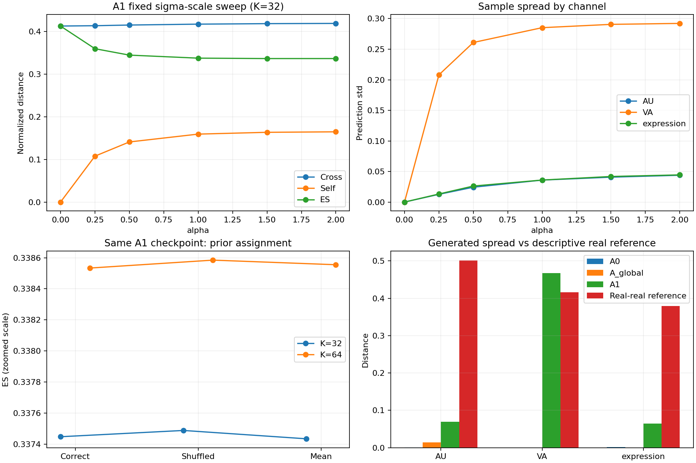

# HiRP Phase 1.5 attribution audit

Base commit: `e03870fe01c8afdd0f633b8ee90acfb6da13c49b`. Core model/config files are unchanged. All three arms were initialized from scratch; no old checkpoint was loaded for training. Only the resulting audit checkpoints were loaded for read-only evaluation. No new loss, regularizer, bound, residual-scale change, group training, or official test.

## Interpretation

Within this short single-seed experiment, A1 has a much better Energy Score than A0/A_global, but correct input-prior assignment has no observable useful advantage over dataset-mean prior and only a tiny difference from a fixed within-session shuffle. The score benefit is dominated by stochastic spread rather than lower paired cross distance. This is evidence against claiming useful input-conditioned adaptation at this stage; it is not a theorem that such conditioning cannot help.

A_global learns only modest bias changes (sigma mean about 1.022), while A1 expands sigma to about 4.740. Same learning rate and step count do not equalize optimization speed between bias-only and context-amplified parameterizations. Therefore the between-arm comparison alone does not establish that global learned noise cannot help. The same-checkpoint mean/shuffle interventions provide the more direct attribution test. No condition-to-latent semantic meaning is claimed.

## Design and audit

- A0: mu=0, log_sigma=0 in an experiment-side hook; all parameters retained.
- A_global: prior forward pre-hook replaces context with zeros. Prior weights have gradients disabled for the forward, preventing both learning and AdamW decay; biases remain learnable. All original parameter objects remain. Weight equality after 64 steps is asserted.
- A1: unchanged conditional prior. Every arm contains 8,728,472 parameters and uses exactly identical initialization, 32 train clips, batch order, independent training noise, optimizer settings and steps; SHA-256 comparisons passed.
- Training: GPU 1, T=128, K=4, B=4, 64 steps/arm, AdamW lr=3e-4, weight_decay=0.01 (unchanged from Phase 1), seeds 123/456/789. No long training or added regularization.
- Validation: 80 fixed clips, 4 sampled per each of 20 sessions using seed 1501. Exact indices, IDs, sessions, crop offsets and lengths are in manifest.json. Equal session allocation intentionally does not estimate the original imbalanced clip-frequency distribution.
- Evaluation: common [1,64,32] Gaussian bank, seed 321, shared across inputs/arms/interventions. K=32 is its prefix; K=64 checks the three arms and correct/shuffled/mean. Sweep is evaluation-only alpha in [0,.25,.5,1,1.5,2], with z=mu+alpha*sigma*epsilon and no additional clamping.
- Shuffled prior: one fixed seed-1502 derangement inside each session, no self assignment; exact donor/recipient IDs saved. Mean prior: arithmetic mean mu and arithmetic mean sigma across all 80 validation inputs, no targets; independent of evaluation batching.
- Checkpoint file hashes and model-state hashes were unchanged after evaluation. Evaluation refuses mismatched data/normalization/checkpoint hashes. training_manifest.json is immutable; manifest.json adds final checkpoint hashes.
- 448 selected raw data files (4 per each of 112 train+validation clips) have individual SHA-256, plus mean_face.npy/std_face.npy. The canonical data-file list itself is hashed. Exact runtime source was archived in runtime_source.tar.gz and matches the original training/evaluation source hashes.

Random-crop preflight analytically enumerates all source-only starts 0..max(0,S-128); a start >= target_length would have zero overlap. Across all 1660 train and 571 val records, zero records have such a start. Total source/target lengths differ for 7 train and 8 val records. Shortest source: train=58, val=245. Cropping for these experiments remains deterministic center cropping.

## Main K=32 results

| Arm | Cross | Self | ES | Prediction std |
| --- | --- | --- | --- | --- |
| A0 | 0.4119507 | 0.0017394539 | 0.41108097 | 0.0003825664 |
| A_global | 0.41286504 | 0.011167269 | 0.4072814 | 0.0024667532 |
| A1 | 0.41714729 | 0.1593989 | 0.33744783 | 0.055909724 |

## Same-checkpoint interventions

Positive delta = intervention ES minus correct ES (worse). Bootstrap intervals resample 20 sessions (10,000 resamples, seed 1503), preserving dependence among 4 clips in each session. They do not capture training-seed, noise-bank or shuffle-permutation uncertainty.

| K | Prior | Cross | Self | ES | Delta ES | Session-bootstrap 95% interval |
| --- | --- | --- | --- | --- | --- | --- |
| 32 | correct | 0.41714729 | 0.1593989 | 0.33744783 | 0 | - |
| 32 | shuffled | 0.41713838 | 0.15930033 | 0.33748822 | 4.0384568e-05 | [-5.4973834e-05, 0.00014140907] |
| 32 | dataset_mean | 0.41715447 | 0.15943984 | 0.33743455 | -1.3280846e-05 | [-0.00010336148, 7.0376727e-05] |
| 64 | correct | 0.41643886 | 0.15581051 | 0.3385336 | 0 | - |
| 64 | shuffled | 0.41643766 | 0.15570618 | 0.33858457 | 5.0966069e-05 | [-4.1032606e-05, 0.00015050621] |
| 64 | dataset_mean | 0.41642996 | 0.15574998 | 0.33855497 | 2.1371432e-05 | [-8.6575137e-05, 0.00011884499] |

## Sigma sweep (A1, K=32)

| alpha | Cross | Self | ES | Prediction std |
| --- | --- | --- | --- | --- |
| 0.0 | 0.41268865 | 9.999999e-05 | 0.41263864 | 0 |
| 0.25 | 0.4134718 | 0.10774453 | 0.35959954 | 0.028453935 |
| 0.5 | 0.41504887 | 0.14100215 | 0.3445478 | 0.043837065 |
| 1.0 | 0.41714729 | 0.1593989 | 0.33744783 | 0.055909724 |
| 1.5 | 0.41829605 | 0.16361515 | 0.33648847 | 0.061070704 |
| 2.0 | 0.41888311 | 0.16475681 | 0.33650471 | 0.063915596 |

At alpha=0 predictions are identical across samples; the self term is still 0.0001 because the unchanged norm includes eps=1e-8. That is a numerical floor, not actual diversity. Larger alpha lowers ES mainly via a larger self term while cross distance worsens; the sweep is not used to retrain or select a final model.

## Per-channel results (K=32)

All distances use RMS Euclidean norm over valid pair frames and the indicated channels, in stored channel units. No channel reweighting was added. Per-channel ES is evaluation-only. Per-recording metrics are macro-averaged. Boundary = within 0.01 of [0,1] endpoints for AU/expression or [-1,1] for VA. Entropy uses natural logs. Velocity uses first frame differences, without an assumed fps.

| Arm | Channels | Cross | Self | ES | Pred std | Boundary fraction | Velocity abs | Velocity RMS | Expr entropy |
| --- | --- | --- | --- | --- | --- | --- | --- | --- | --- |
| A0 | AU | 0.37531954 | 0.0012160026 | 0.37471154 | 0.0002071904 | 0.20795818 | 0.013356441 | 0.027983084 | - |
| A0 | VA | 0.78613537 | 9.999999e-05 | 0.78608537 | 0 | 0.5 | 0.0472048 | 0.088767622 | - |
| A0 | expression | 0.30917073 | 0.0017308878 | 0.30830528 | 0.00080703806 | 0.42036209 | 0.017195003 | 0.036521508 | 1.1035607 |
| A_global | AU | 0.37566741 | 0.014415281 | 0.36845977 | 0.0041090743 | 0.20051698 | 0.01459478 | 0.029507902 | - |
| A_global | VA | 0.78423696 | 9.999999e-05 | 0.78418696 | 5.8283385e-12 | 0.5 | 0.045361125 | 0.085871211 | - |
| A_global | expression | 0.31307701 | 0.00010152436 | 0.31302625 | 4.0899163e-06 | 0.33355293 | 0.016006576 | 0.032852423 | 1.1490501 |
| A1 | AU | 0.37458936 | 0.069723791 | 0.33972747 | 0.035945939 | 0.14229412 | 0.018001644 | 0.034009765 | - |
| A1 | VA | 0.81476527 | 0.46770973 | 0.5809104 | 0.28517957 | 0.50059204 | 0.039409794 | 0.11976303 | - |
| A1 | expression | 0.31486422 | 0.064606543 | 0.28256095 | 0.036024369 | 0.27180023 | 0.01584943 | 0.033286804 | 1.1824741 |

## Real-real descriptive reference

120 unordered within-session pairs among the selected 80 real listener trajectories. Distance uses the common valid crop length and relative frame positions; summary distances also compare each channel temporal mean/std. These are different speaker inputs, not ground-truth draws from the same conditional distribution. They never enter training, and are not a target spread that generation should be forced to match.

| Channels | Real-real mean | p05 | p50 | p95 | A1 generated self |
| --- | --- | --- | --- | --- | --- |
| overall | 0.46506011 | 0.33498588 | 0.46879448 | 0.60713981 | 0.1593989 |
| AU | 0.50093293 | 0.31782951 | 0.50698191 | 0.65393442 | 0.069723791 |
| VA | 0.41588849 | 0.17176167 | 0.36528318 | 0.81607763 | 0.46770973 |
| expression | 0.37920383 | 0.15447244 | 0.41880605 | 0.48048544 | 0.064606543 |

| Real channels | Boundary fraction | Velocity abs | Velocity RMS | Entropy |
| --- | --- | --- | --- | --- |
| AU | 1 | 0.024573491 | 0.14570866 | - |
| VA | 0.00092773437 | 0.035984512 | 0.050771714 | - |
| expression | 0.79532471 | 0.024471924 | 0.079293859 | 0.31094077 |

Full real temporal mean/std, first-difference summaries, distribution mean/std/p05/p50/p95, per-recording values, pair distances and summary-vector distances are in evaluation/real_real_reference.json. Generated per-recording spread distributions are also saved in every case file.

Notable mismatch: generated VA sits at a boundary for about 50% of elements, versus about 0.093% in the selected real VA; A1 VA velocity RMS is also much higher than real VA. A1 expression entropy is much higher than real expression entropy. These are descriptive failures, not evidence of calibrated reactions.

## Prior clamp and residual saturation

| Arm | sigma mean | sigma std | sigma min | sigma max | Lower clamp | Upper clamp | raw abs mean | residual abs mean | tanh saturation |
| --- | --- | --- | --- | --- | --- | --- | --- | --- | --- |
| A0 | 1 | 0 | 1 | 1 | 0 | 0 | 8.4739379 | 0.97417279 | 0.9236262 |
| A_global | 1.0215598 | 0.031728834 | 0.95001763 | 1.0710471 | 0 | 0 | 8.0115247 | 0.98617812 | 0.93855918 |
| A1 | 4.7403593 | 3.2682838 | 0.067767642 | 7.3890562 | 0 | 0.54023439 | 6.8040376 | 0.94807283 | 0.79828148 |

Tanh saturation threshold is abs(tanh(stochastic_raw))>=0.99, measured only on source-valid frames. Prior clamp statistics refer to the base prior before alpha scaling. No upper bound or residual scale was changed.

## K=64 stability

| Arm | K32 ES | K64 ES | Difference |
| --- | --- | --- | --- |
| A0 | 0.41108097 | 0.41115516 | 7.4188784e-05 |
| A_global | 0.4072814 | 0.40759695 | 0.00031554848 |
| A1 | 0.33744783 | 0.3385336 | 0.0010857686 |



## Tests and artifacts

Complete CPU results are in runs/phase15/pytest_results.txt. Tests cover bias-only global updates with AdamW, parameter preservation and exception cleanup, K<2 errors, reproducible stratification/derangement, arithmetic mean sigma, eval-only overrides and alpha=0, channel ES equivalence/masking, entropy/boundaries/velocity, real-real session restrictions, exact random-crop risk, raw-data hash mismatch detection, and checkpoint roundtrip. There is one PyTorch TypedStorage deprecation warning.

Runtime checkpoint paths (local, intentionally Git-ignored):

| Arm | Checkpoint | SHA-256 |
| --- | --- | --- |
| A0 | checkpoints/A0.pt | f0e2128e1b6ad577b3367c57851ed35520385759d769a29975d590d5f0373dd0 |
| A_global | checkpoints/A_global.pt | 7149fd56eba5656afde25cbaffb3aef05324ffba2032aa76195976bb77c6aafd |
| A1 | checkpoints/A1.pt | 604339265c9aa108a2e2f96ebac2850ad545c044770ab27d09bdaaac1f9c1fdd |

Other artifacts: training_manifest.json / manifest.json; training_summary.json; A0/A_global/A1_training.jsonl; random_crop_audit.json; runtime_source.tar.gz; evaluation/manifest.json, common_noise_K64.npy, *_prior_cache.npz, 15 per-case JSON files, summary.json, session_bootstrap.json, real_real_reference.json, attribution_curves.png/svg. artifact_inventory.json lists every file with bytes and SHA-256 except the inventory itself. No raw REACT data were copied.

All requested Phase 1.5 work completed. Limits: one short training seed, one fixed within-session shuffle, center crops of length 128, 80 stratified examples, and different optimization dynamics for bias-only versus conditional parameterization. No claim of useful input-prior adaptation is supported here. Checkpoints are retained for further read-only evaluation. No additional training was performed after attribution.

Replay evaluation into a NEW directory (does not modify checkpoint files):

```bash
.venv/bin/python -m hirp.evaluate_phase15 --run runs/phase15 --output runs/phase15/evaluation_repeat --device cuda:1
```
