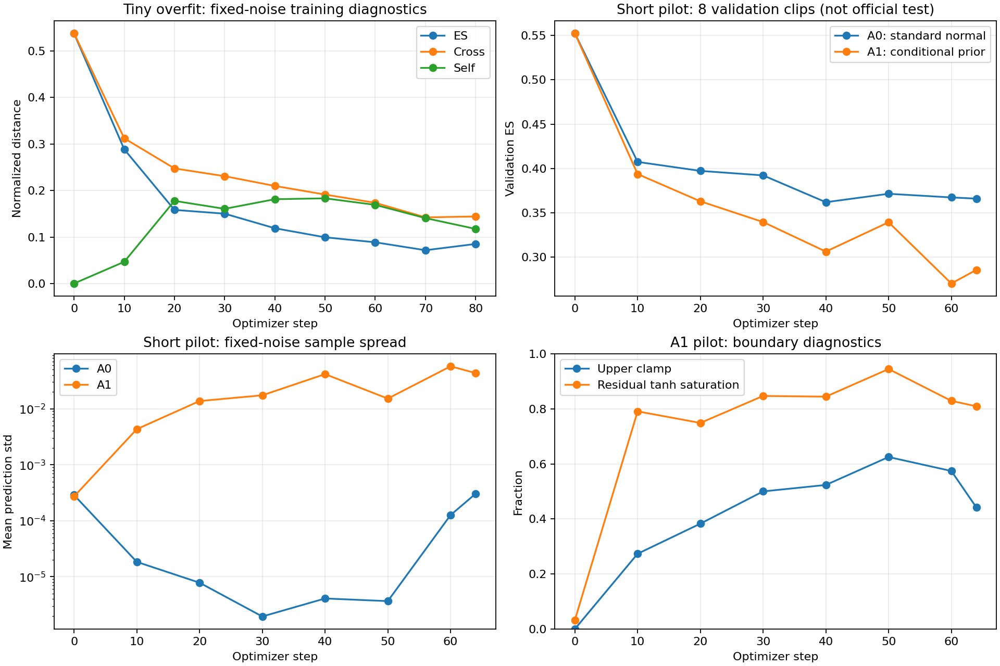

# HiRP Phase 1: paired-only training preparation

Completed with the scratch-v0 network unchanged (all `hirp/model/*.py` and `config.py` unchanged). No additional loss or prohibited mechanism. All runs start from scratch; no checkpoint was loaded. No official full test or long training was run.

## Implementation and length semantics

- `hirp/paired_data.py`: independent speaker-to-paired-listener feature loader; aligned source-only crops; no alternative listener lookup or group pool.
- `hirp/phase1_diagnostics.py`: masked prior/noise/residual probes and temporary A0 prior-output hook. A0 retains every model parameter but bypasses mu/log_sigma; its prior gradients are expected to be zero.
- `hirp/train_phase1.py`: bounded real-data runs, reproducible independent training noise, fixed validation noise, per-step JSONL and interval diagnostics, and a pilot gate.
- `hirp/tests/test_phase1.py`: eight additional tests; entire suite now 46 tests.
- `hirp/losses/energy_score.py`: optional details with exactly unchanged scalar computation and gradients, always float32. Unit scales used for all experiments.
- `hirp/data_adapter.py`: explicit source_lengths has priority in the compatibility helper; the new pipeline uses the strict paired_model_inputs helper.

`source_lengths=min(audio, emotion, 3DMM valid lengths)` after crop. `pair_lengths=min(source_lengths, target valid length after the same crop)`. Only source_lengths enters forward as its existing lengths argument; only pair_lengths defines the ES mask. No target tensor or target length enters the generator. Crops with no paired overlap are explicitly rejected, not silently resampled using target information.

Actual disk shapes: audio [T,768], attributes [T,25], coefficients [T,1,58]. Only the middle singleton is removed; FaceVerse mean/std normalize 3DMM before padding. Attributes stay in stored units. The current train.csv/val.csv describe other UDIVA-style paths, so this pipeline follows the validated feature directory splits rather than those CSV paths. Phase 1 uses speaker -> listener only (1660 train, 571 val), not reverse-role duplication.

Actual tiny batch: audio [8,128,768], emotion [8,128,25], 3DMM [8,128,58], paired_target [8,128,25], source_lengths [8], pair_lengths [8], clip_id/session_id each 8 strings. Training lengths were all 128/128. Pilot batches are B=4 with the same T and widths.

Real unequal-length test: speaker/session0/Camera-2024-06-28-164549-164628 has full source 1018 and target 1017 frames. A source-only tail crop starts at 954 and returns source_lengths=64, pair_lengths=63, padded to T=128. The model mask keeps 64 frames; ES uses 63. Changing target padding leaves context/output unchanged. Changing source padding leaves context/output unchanged. A separate fixture (source=11, pair=5) verifies that changing valid source frames beyond pair length still changes context.

Length header audit: 7 train and 8 val recordings have different total source/target lengths. Center crops used here have no empty pair masks; one train recording has source length below 128. See runs/phase1/length_audit.json.

## Validation and reproducibility

`PYTHONDONTWRITEBYTECODE=1 .venv/bin/python -m pytest hirp/tests -v -s -p no:cacheprovider`: **46 passed in 3.81s**, including real-data integration cases; no skips. Complete output: runs/phase1/pytest_results.txt.

All runs used GPU 1, T=128, K_train=K_validation=4, float32, AdamW lr=3e-4 / weight_decay=0.01, same architecture (8,728,472 parameters), no residual scaling changes. Tiny uses first 8 train records (session0), 80 full-batch steps. Pilot uses 32 seeded-random train records, batch size 4, 64 steps per arm; fixed 8 validation records are all session0. These are deliberately narrow mechanism probes.

Each run directory contains manifest.json with source hashes, sample IDs/crops, seeds, shapes, optimizer, device, Git base and dirty diff; validation_noise.npy stores the exact shared [1,4,32] bank, repeated across inputs for same-noise comparisons. Training noise is independent across B and K and identical between arms. Model-state, training-index and noise-stream SHA256 match between A0 and A1; parameter counts match. Both arms start fresh, neither starts from tiny weights. No checkpoint was saved by these bounded probes.

Validation mode disables dropout and restores module modes. All noise/residual distances mask source padding; paired ES masks pair padding. Same-session output distances use the intersection of source-valid frames, not temporal alignment or group supervision. sigma_std is population std over all B x latent dimensions; mu_std_across_batch is mean per-coordinate population std across B. Tanh saturation means abs(tanh(raw)) >= 0.99. The Euclidean epsilon floor is 1e-4 for identical predictions, so prediction std is also reported to detect near-collapse.

## Tiny overfit

The predeclared engineering gate passed: fixed-noise training ES falls at least 5%; final prediction std exceeds 1e-5; all 80 steps have finite nonzero mu/log_sigma gradients. This is a liveness/optimization gate, not a calibration guarantee.

| Step | Fixed-noise train ES | Cross | Self | Validation ES |
| --- | --- | --- | --- | --- |
| 0 | 0.53728062 | 0.53763473 | 0.00070817524 | 0.55245072 |
| 10 | 0.28866011 | 0.31230655 | 0.047292799 | 0.34229517 |
| 20 | 0.15867269 | 0.24769966 | 0.17805393 | 0.26000974 |
| 30 | 0.15055716 | 0.23102787 | 0.16094139 | 0.26369768 |
| 40 | 0.11930223 | 0.21009015 | 0.18157583 | 0.25275433 |
| 50 | 0.099853471 | 0.19160903 | 0.18351111 | 0.26742911 |
| 60 | 0.089131728 | 0.17387204 | 0.16948061 | 0.26468748 |
| 70 | 0.072098374 | 0.14263988 | 0.14108302 | 0.26526785 |
| 80 | 0.085572377 | 0.1444971 | 0.11784943 | 0.26782382 |

Final training ES is 84.073057% below initialization. Step 70 is lower than step 80; no best-checkpoint selection or extra tuning was done.

| Metric (tiny training monitor) | Initial | Step 80 |
| --- | --- | --- |
| latent_mu_mean | 0.030822307 | 0.1395061 |
| latent_mu_std_across_batch | 0.096152782 | 0.18505269 |
| sigma_mean | 0.97530472 | 4.5692549 |
| sigma_std | 0.25402051 | 3.3080671 |
| sigma_min | 0.56983232 | 0.081686765 |
| sigma_max | 1.8639183 | 7.3890562 |
| log_sigma_lower_clamp_fraction | 0 | 0 |
| log_sigma_upper_clamp_fraction | 0 | 0.5703125 |
| mean_pairwise_reaction_distance | 0.00070817524 | 0.11784943 |
| mean_absolute_prediction_std_across_samples | 0.00026262578 | 0.017521866 |
| same_session_mu_distance | 0.87878656 | 1.5884454 |
| same_session_sigma_distance | 0.73969311 | 3.2350526 |
| same_session_fixed_noise_output_distance | 0.24697697 | 0.39587682 |
| stochastic_raw_abs_mean | 1.0650893 | 5.2361975 |
| stochastic_residual_abs_mean | 0.64585084 | 0.95692337 |
| tanh_saturation_fraction | 0.042734373 | 0.79335934 |

| Gradient L2 norm | Tiny step 1 | Tiny step 80 | Pilot A1 step 64 |
| --- | --- | --- | --- |
| prior_mu_gradient_norm | 0.00037881907 | 0.085979722 | 0.045542721 |
| prior_log_sigma_gradient_norm | 0.00045048926 | 0.033593755 | 0.0071180342 |

## Matched A0/A1 short pilot

| Final validation metric | A0 | A1 |
| --- | --- | --- |
| loss | 0.36610806 | 0.28585914 |
| cross_distance | 0.36692637 | 0.37434924 |
| self_distance | 0.001636626 | 0.17698023 |
| latent_mu_mean | 0 | 0.18274343 |
| latent_mu_std_across_batch | 0 | 0.11264955 |
| sigma_mean | 1 | 4.6817722 |
| sigma_std | 0 | 3.2104201 |
| sigma_min | 1 | 0.10350427 |
| sigma_max | 1 | 7.3890562 |
| log_sigma_lower_clamp_fraction | 0 | 0 |
| log_sigma_upper_clamp_fraction | 0 | 0.44140625 |
| mean_absolute_prediction_std_across_samples | 0.00030369262 | 0.043322258 |
| same_session_mu_distance | 0 | 0.93650168 |
| same_session_sigma_distance | 0 | 2.3514912 |
| same_session_fixed_noise_output_distance | 0.20623605 | 0.19897944 |
| stochastic_raw_abs_mean | 8.0610762 | 6.3529625 |
| stochastic_residual_abs_mean | 0.96837139 | 0.95575476 |
| tanh_saturation_fraction | 0.92600584 | 0.80919921 |

A1 validation ES is lower, but its cross distance is slightly worse; the net gain comes from its larger self-distance. The learned prior varies across same-session inputs (28 pairs) and stochastic usage remains measurable. This does NOT isolate the causal benefit of input conditioning from learnable global scale/shift or sigma inflation. A0 also remains input-conditioned through H, despite its fixed prior. There is no evidence here for calibrated conditional distributions or broad generalization.

Boundary concern: tiny ends with 57.0% upper-clamped log_sigma and 79.3% tanh saturation on its training monitor. A1 pilot validation ends with 44.1% upper-clamped log_sigma and 80.9% tanh saturation. A0 saturation is 92.6%. No new loss, scale adjustment or follow-up sweep was introduced to hide these findings.



## Artifacts and remaining work

Raw per-step ES/cross/self/prior statistics/gradient norms: runs/phase1/{tiny,pilot}/*_training.jsonl. All interval prior/noise/condition/residual diagnostics: *_intervals.jsonl. Final and initial aggregates: summary.json. Full sample metadata: manifest.json. Curves: phase1_curves.png and editable vector phase1_curves.svg.

All requested Phase 1 steps completed. No additional experiments are running. Remaining research questions: whether useful conditional adaptation exceeds global variance adjustment, how to interpret high clamp/saturation, and whether results hold beyond one seed and eight session0 validation clips. These are unresolved, not claims of success. No checkpoints were retained. Official full test, long training, group loss/sampler, session marginal matching, local temporal noise, multiscale ES, KL/VAE/GMM/flow/diffusion/Mamba/query/set OT/CVaR remain intentionally unimplemented.

Reproduce (choose new output directories; existing run directories are never overwritten):

```bash
.venv/bin/python -m hirp.train_phase1 --phase tiny --output runs/phase1/tiny_repeat --device cuda:1
.venv/bin/python -m hirp.train_phase1 --phase pilot --output runs/phase1/pilot_repeat --tiny-summary runs/phase1/tiny_repeat/summary.json --device cuda:1
```
