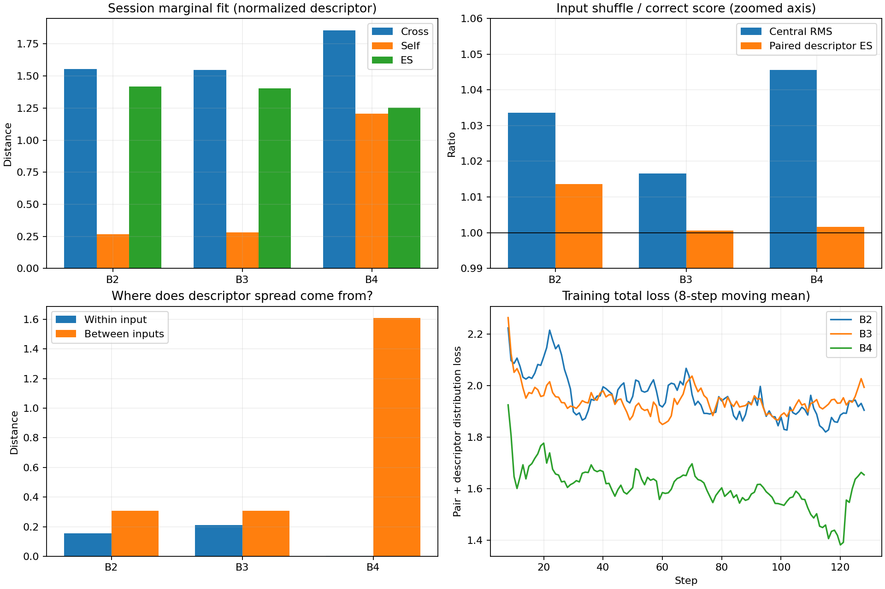

# Phase 2: Hierarchical Distribution Supervision — bounded pilot

Branch: `agent/hirp-phase2-hierarchy`. Base commit: `c2d92c9df528ac42850b9a874005ff305d40473f`. Final local commit is supplied in the completion message (a commit cannot contain its own hash). No push. Core hirp/model files, model config, Phase 1/1.5 code/reports/artifacts are unchanged.

## Answer to Q1–Q4

**Q1 — Marginal fit:** B4 has lower validation session-marginal descriptor ES than B2/B3. However its cross distance is WORSE, and the gain comes from a much larger between-input self term. This supports an effect of the hierarchy connection on the supervised statistic, not calibrated population matching.

**Q2 — Correspondence:** B4 has a better overall central paired RMS and larger central input-shuffle gap than B3 in point estimates. Its AU and expression paired distances are worse; the overall gain is driven by VA. Paired descriptor ES is substantially worse and its shuffle gap is tiny. Session-bootstrap uncertainty is reported below; useful correspondence preservation is not established robustly.

**Q3 — Diversity shape:** B4 expression entropy is closer to the real-reference summary, and VA velocity becomes nonzero and closer in RMS. But VA boundary occupancy remains approximately 96.4% (real about 0.030%), and conditional AU/expression stochastic spread nearly collapses. The shape failure is not repaired.

**Q4 — Hierarchy versus variance:** B4 has tiny within-input stochastic spread and much larger BETWEEN-input descriptor distances. It is not winning by more within-input noise. Yet its ES gain is driven by larger aggregate marginal spread with worse cross fit; this does not exclude a variance-driven or extreme-output explanation. This pilot does NOT establish the intended complete mechanism.

## Implemented connection and fixed boundaries

New source: session_data.py, group_features.py, group_scores.py, train_phase2.py, evaluate_phase2.py, summarize_phase2.py, tests/test_phase2.py. Root .gitignore only adds the local Phase 2 checkpoint directory. All three models retain 8,728,472 parameters, use prior_mode=A0 and have unchanged ConditionalPrior parameters after training. No conditional Gaussian tuning or prohibited model/loss was introduced.

Every step uses two gradient-enabled model.forward calls: zero noise, K=1 central prediction for L_pair; independent noise, K=4 samples for L_dist. L_pair is mean valid-pair RMS Euclidean in 25 raw output dimensions. Total loss is L_pair + 1.0*L_dist. No sample/no_grad wrapper is used for training.

B2 matches each generated descriptor distribution to its paired singleton. B3 matches each input separately to the same-session unique reference set. B4 cross averages banks (occurrences 0/1 and 2/3) against the references, while its self is ONLY the full cross-bank mean. It does not use an iid flattened self statistic. Source repetitions across banks are permitted because occurrences are drawn independently with replacement.

## Descriptor and scaler

phi has 75 coordinates: temporal mean(25), population temporal std(25), first-difference RMS(25). Valid frames only; length-one velocity has an explicit false coordinate mask. Distances use only jointly valid coordinates. Vector norms use finite zero subgradients, and no epsilon pseudo-velocity is inserted. Descriptors do not learn parameters.

Prediction descriptors use source_lengths in all three arms. Paired target descriptors use pair_lengths; the central correspondence mask also uses pair_lengths. Independent listener references use their own center crops and lengths. No framewise alignment is assumed between independent interactions.

Frozen train-only scaler: (phi-mean_train)/max(std_train,1e-4), fit to all 1660 unique TRAIN listener clips with independent T=128 center crops. Invalid coordinates are excluded from fitted moments/counts; scaler tensors are buffers, not trainable parameters. VAL never refits. Exact source file SHA-256 and crop metadata are included in descriptor_stats.json.

File SHA-256: `581c3b7b058674d5bca11acd34577e0546bd0babb73bfd2a5aade3d0bc09ca2d`.

Train scaler source-list hash: `62dbae21bf1077d8d9c7fd9427b72c2e85b449a3488e1acb1e202d27c093822b`.

## Sampling and exact controls

After split filtering, the train pool has 17 sessions, 1660 unique speaker sources and 1660 unique listener refs. Each step chooses session with p(s)=n_s/1660, then four IID source occurrences with replacement. References are up to eight unique clips uniformly without replacement, including paired listeners when selected. Reference crops are computed independently from source offsets. No ref slots are duplicated.

128 steps produce 512 source occurrences / 439 unique sources. 5 steps contain repeated source IDs, as allowed. B3/B4 each use 1024 reference occurrences / 775 unique refs. B2 training performs zero population reference lookups; shared train-only scaler fitting is the explicit common preprocessing.

| Schedule component | SHA-256 |
| --- | --- |
| session_schedule_hash | 25a0a8b55f134f2e575c1547a6de65b0a5fbcd6c409f49817b8a4974bca152ee |
| source_occurrence_hash | bd480fe77d8b996bc28638b9c9c0a0576685add77db0a9a354ef21cc9006eb1b |
| reference_selection_hash | b1a9300c585d3550fd0d45ff155e55cfb4fa697bdcecb1fec3c4a6d12bb42bab |
| noise_hash | 150162865ea0e4b159429da42d1f8f80adfa31d88bb3c43a4541220a6292e0aa |

Initialization hash: `0212bacdc3f92ba126a1387aca0b5409fcbd20362ca89194f630abecc6d8c437`. Runtime consumed schedules/noise/scaler hashes, parameter counts, step counts and optimizer settings match across all arms; B3/B4 consumed reference hashes match the planned reference hash. Complete probabilities and empirical session counts are in sampling_audit.json.

Config: T=128, K_train=4, B=4, R<=8, steps=128, lambda_dist=1, AdamW lr=3e-4 / weight_decay=.01. Initialization seed=123, session=2001, source=2002, reference=2003, noise=789. GPU 2. No subsequent tuning, extra steps, best-checkpoint selection, or additional loss.

## Gradient preflight

| Arm | Pair magnitude | Dist magnitude | Pair grad L2 | Dist grad L2 | Larger/smaller |
| --- | --- | --- | --- | --- | --- |
| B2 | 0.53715634 | 2.3799539 | 1.4067721 | 13.438331 | 9.5525994 |
| B3 | 0.53715634 | 2.4015691 | 1.4067721 | 12.91259 | 9.1788781 |
| B4 | 0.53715634 | 1.9485488 | 1.4067721 | 23.609419 | 16.782689 |

Both terms were backwarded separately before optimization on the first matched batch. All ratios are below 100, so the stop gate passed without changing lambda. Module-specific norms are saved. During training, every total gradient is finite and every prior gradient is zero. Separate component gradient ratios were not remeasured on every later step.

## Fixed validation and estimator

Exactly the Phase 1.5 frozen 80 clip IDs (4 x 20 sessions), hash `a81970994750843aa196a0f2ff08c5ad4de0314aa4cfafc8b0b22b5092dba6f9`. K=32 uses the saved Phase 1.5 noise-bank prefix, identical across inputs/arms. All 571 unique VAL listener references are used as Q_s, uniformly within session, with independent center crops. Results macro-average the 20 sessions.

Session marginal self correctly handles shared random numbers: equal epsilon indices are excluded for ALL input pairs. The estimator is the uniform mixture over four fixed sources, with independent epsilon draws; an ordinary iid self-term on all flattened correlated outputs would be biased. Tests cover this distinction. Evaluation target/ref information never enters the generator.

Conditionality gap is reported both as the requested ratio shuffled/correct and as shuffled-correct difference. A fixed same-session derangement (seed 1502) is saved. These are relative-input tests, not semantic claims about latent coordinates.

## Paired correspondence and population fit

| Arm | Central paired RMS | AU paired | VA paired | Expression paired | Session ES | Per-input population ES |
| --- | --- | --- | --- | --- | --- | --- |
| B2 | 0.48227991 | 0.36033749 | 1.1789801 | 0.34226457 | 1.4187967 | 1.4751188 |
| B3 | 0.47424942 | 0.36325125 | 1.1789775 | 0.30497708 | 1.4046994 | 1.4406192 |
| B4 | 0.45771873 | 0.38281067 | 0.93186156 | 0.37429256 | 1.2527496 | 1.8552377 |

| Arm | Marginal cross | Marginal self | Marginal ES | Within-input descriptor self | Between-input descriptor distance |
| --- | --- | --- | --- | --- | --- |
| B2 | 1.5529146 | 0.26823573 | 1.4187967 | 0.15559156 | 0.30578378 |
| B3 | 1.545907 | 0.28241529 | 1.4046994 | 0.21057581 | 0.30636179 |
| B4 | 1.8559115 | 1.2063238 | 1.2527496 | 0.0013477645 | 1.6079824 |

For four equally weighted source components, marginal self = 1/4 within-input self + 3/4 between-input distance (all under distinct noise indices). This decomposition is algebraic from the same estimator; no new model run was performed.

## Input-shuffle conditionality

| Arm | Score | Correct | Shuffled | Ratio | Difference |
| --- | --- | --- | --- | --- | --- |
| B2 | Central RMS | 0.48227991 | 0.49846622 | 1.0335621 | 0.016186305 |
| B2 | Paired descriptor ES | 1.4616712 | 1.4816575 | 1.0136736 | 0.019986236 |
| B3 | Central RMS | 0.47424942 | 0.48211215 | 1.0165793 | 0.0078627232 |
| B3 | Paired descriptor ES | 1.445252 | 1.4460575 | 1.0005573 | 0.0008054927 |
| B4 | Central RMS | 0.45771873 | 0.47857582 | 1.0455675 | 0.020857093 |
| B4 | Paired descriptor ES | 1.8652574 | 1.8683887 | 1.0016787 | 0.0031312212 |

Session bootstrap uses 10,000 resamples of 20 paired sessions, seed 2004. It quantifies variation across these selected sessions only, not training-seed or shuffle-permutation uncertainty. Negative ES/RMS differences favor B4; positive shuffle-gap differences indicate stronger measured input sensitivity.

| B4 minus baseline contrast | Mean | 95% session-bootstrap interval |
| --- | --- | --- |
| B4_minus_B2_marginal_ES | -0.1660471 | [-0.22584647, -0.10532131] |
| B4_minus_B2_central_RMS | -0.024561181 | [-0.037372005, -0.012081056] |
| B4_minus_B2_central_shuffle_gap | 0.0046707883 | [-0.0076706711, 0.016511756] |
| B4_minus_B2_paired_descriptor_shuffle_gap | -0.016855015 | [-0.059302586, 0.023399397] |
| B4_minus_B3_marginal_ES | -0.15194979 | [-0.20595972, -0.095964108] |
| B4_minus_B3_central_RMS | -0.016530693 | [-0.0270716, -0.0066592553] |
| B4_minus_B3_central_shuffle_gap | 0.01299437 | [-0.0014590589, 0.027332983] |
| B4_minus_B3_paired_descriptor_shuffle_gap | 0.0023257285 | [-0.035928053, 0.039775086] |

## Diversity shape (raw reaction units)

| Arm | Group | Cross | Self | Prediction std | Boundary fraction | Velocity abs | Velocity RMS | Expression entropy |
| --- | --- | --- | --- | --- | --- | --- | --- | --- |
| B2 | overall | 0.47965269 | 0.040278918 | 0.011765238 | 0.36747338 | 0.020458637 | 0.047362086 | - |
| B2 | AU | 0.36033482 | 0.00031051562 | 8.4290698e-05 | 0.15019044 | 0.025869732 | 0.05028014 | - |
| B2 | VA | 1.1789801 | 9.999999e-05 | 2.122489e-10 | 1 | 6.7164949e-08 | 2.2022686e-07 | - |
| B2 | expression | 0.33189898 | 0.071093512 | 0.036608323 | 0.61674728 | 0.015427474 | 0.047396431 | 0.57879755 |
| B3 | overall | 0.4751567 | 0.067101023 | 0.02129575 | 0.28990063 | 0.027485458 | 0.059349404 | - |
| B3 | AU | 0.36414748 | 0.038759695 | 0.0089615036 | 0.084922287 | 0.031048504 | 0.058685735 | - |
| B3 | VA | 1.1789775 | 9.999999e-05 | 0 | 1 | 7.6975644e-07 | 1.9306282e-06 | - |
| B3 | expression | 0.3065596 | 0.098853597 | 0.049746402 | 0.49671021 | 0.027675916 | 0.067341349 | 1.1321314 |
| B4 | overall | 0.45772792 | 0.00054869391 | 8.0177797e-05 | 0.50446288 | 0.03677619 | 0.09592721 | - |
| B4 | AU | 0.3828272 | 0.00068981629 | 0.00013067737 | 0.30933372 | 0.038325079 | 0.075479023 | - |
| B4 | VA | 0.93186156 | 9.999999e-05 | 0 | 0.9640625 | 0.022246439 | 0.065979088 | - |
| B4 | expression | 0.37429279 | 0.00011956405 | 5.5355621e-06 | 0.75543022 | 0.037504458 | 0.10950251 | 0.3850915 |

Raw trajectory metrics use valid paired frames; descriptors are separately standardized and must not be numerically conflated with this table. Boundary tolerance is 0.01 from output-domain endpoints. Velocity uses adjacent frames, with no assumed fps. Entropy is in nats. A self distance near 0.0001 can be just the unchanged epsilon floor, not genuine stochastic variation.

| Arm | Raw stochastic abs | tanh residual abs | tanh saturation |
| --- | --- | --- | --- |
| B2 | 7.2507295 | 0.99703159 | 0.96929771 |
| B3 | 6.685152 | 0.96258978 | 0.8591544 |
| B4 | 7.9493933 | 0.97943916 | 0.90686411 |

## Real-reference description

571 unique val references yield 20,157 unordered same-session pairs. Session-macro real-real normalized descriptor distance is 1.3482941. Per-session distance distributions and crop lists are saved. These are independent interactions under different speaker inputs, not repeated conditional samples for one X. No generated-self-to-real-self penalty was used.

| Real group | Boundary fraction | Velocity abs | Velocity RMS | Expression entropy |
| --- | --- | --- | --- | --- |
| AU | 1 | 0.024236141 | 0.14614831 | - |
| VA | 0.00030025841 | 0.036984158 | 0.052128673 | - |
| expression | 0.77362914 | 0.027798046 | 0.085472792 | 0.35147644 |

Compared with the Phase 1.5 selected-80 descriptive baseline, this baseline now uses the FULL val reference population and session-macro weighting; its numbers should not be mistaken for the identical prior subset.

## Toy hierarchy sanity

Analytic expected descriptor ES on support {-1,+1}: initial B3 ES=0.82000887, B4 marginal ES=0.50002503. B3 optimizes probabilities to [0.4999999403953552, 0.5000001192092896]; B4 retains [0.10000000149011612, 0.8999999761581421]. Both marginals are 0.5. This verifies the loss connection, not a real-data performance result.

## Runtime, tests and artifacts

| Arm | Training seconds | Training peak MiB | Evaluation seconds | Evaluation peak MiB |
| --- | --- | --- | --- | --- |
| B2 | 8.6000106 | 542.979 | 1.478166 | 240.68701 |
| B3 | 8.539521 | 542.98242 | 0.93034315 | 240.68701 |
| B4 | 8.4162309 | 542.98145 | 0.89869549 | 240.68701 |

Times use synchronized CUDA timers around arm compute loops. Shared CPU data loading, scaler fitting, hashing, checkpoint IO and report generation are excluded; peak memory is PyTorch allocated memory, not total device reservation.

Full test output: pytest_results.txt. Tests include split isolation and escape rejection, unique refs, independent crops, descriptor sample-order equivariance/masking/single-frame validity, train-only frozen scaler, hand-calculated B2 ES, B3 permutation invariance, B4 bank exchange and non-iid self, IID replacement schedules/independent noise, generator isolation, real consumed hashes, toy sanity and the original Phase 1/1.5/K-prefix suites.

Artifacts: descriptor_stats.json, training_manifest.json, schedule.json, training_noise.npy, sampling_audit.json, gradient_preflight.json, B2/B3/B4_training.jsonl, training_summary.json, toy_hierarchy.json, runtime_source.tar.gz, pytest_results.txt, evaluation/{B2,B3,B4}.json, summary.json, real_reference.json, manifest.json, common_noise_K32.npy, session_bootstrap.json, spread_decomposition.json, phase2_curves.png/svg, this report and artifact_inventory.json. Checkpoints are retained locally in checkpoints/{B2,B3,B4}.pt, Git-ignored; their hashes are in training_summary.json and the inventory. Inventory excludes itself to avoid a circular hash.



## Unverified / not established

- No SOTA, official-test or generalization claim. One seed, 128 steps, fixed center crops and one shuffle permutation only.
- No evidence that B4 recovered a healthy stochastic conditional distribution: its within-input noise usage nearly disappears.
- Lower marginal ES does not establish correct distribution shape; B4 cross distance is worse and VA remains almost fully saturated.
- Larger central shuffle gap is not a proof of fine correspondence; absolute AU/expression pairing worsens and descriptor shuffle effects are small.
- The hierarchy change causes the observed differences under matched controls, but improvement independent of increased between-input spread is not established.
- No per-step re-audit of separate pair/dist gradient ratios after the initial gate; only finite total-gradient monitoring.
- K64, multiple seeds, long training and official test were not run. No prohibited module, auxiliary loss, lambda sweep or structural adjustment was added.

Replay evaluation into a new directory:

```bash
.venv/bin/python -m hirp.evaluate_phase2 --run runs/phase2 --output runs/phase2/evaluation_repeat --device cuda:2
```
