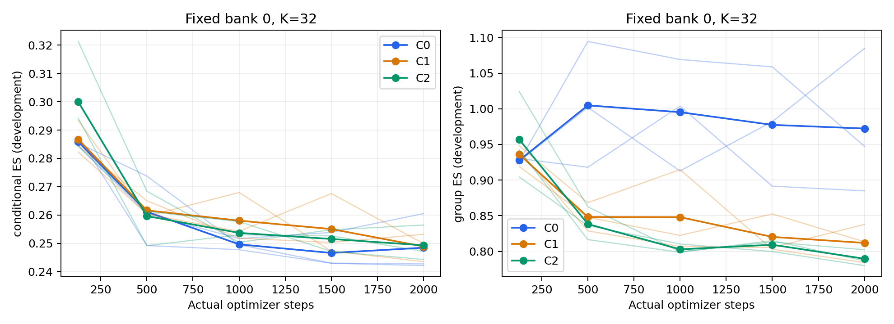
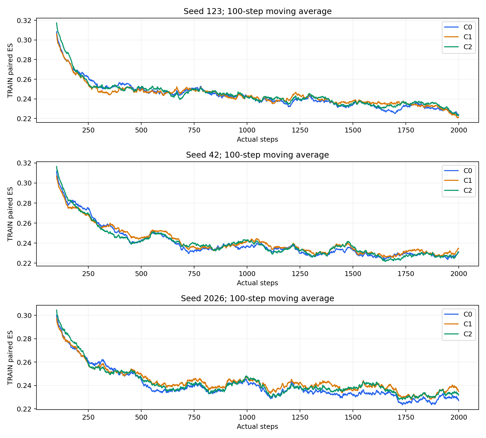

# HiRP Phase 2.2 replicated development pilot

Baseline: acfdda2ef02ebf5340ed13c78084a5d1bc518043. Branch: agent/hirp-phase22-replicated-pilot. No later commits or uncommitted user files at entry. CODEX_PHASE22.md was not found; the full user-supplied task text was used. Review of Phase 2.1 logs was not an independent rerun of historical training.

## What this segment establishes

At equal 2000-step budgets, C2 has lower session-marginal descriptor ES than C1 in all three training seeds at both K=32 and K=64. At K=32, mean group ES is 0.786472 versus 0.806538 (difference -0.020066). Conditional ES does not improve consistently: C2 beats C1 at seed 123, but is worse at seeds 42/2026; means are 0.247742 versus 0.247249. C0 remains the lowest mean conditional endpoint (0.246542). These are development-set observations, not a claim of matched conditional quality or universal superiority.

Direct shuffle-gap contrasts are mixed: C2-C1 is negative at seed 123, near zero at seed 42, positive at seed 2026. No robust cross-seed conditionality advantage is established. The next question is whether the group-score advantage persists when conditional quality is explicitly matched on an independently validated evaluation population. No lambda sweep was run in this segment.

Expression entropy remains high (C2 1.3295 versus real-reference 0.3515), and AU/expressive velocity RMS remains below the real reference. Thus score improvements do not imply calibrated reaction shapes. Real-reference trajectories correspond to different inputs and cannot specify the desired stochastic spread for one fixed input.

## Sampling and training contracts

HiRP22 stores standard_normal / conditional_gaussian as a public forward contract. Standard normal uses z=epsilon without executing the retained prior module. The same inherited sample, eval adapter and strict loader share this rule. Historical A0 migration requires the matching manifest and scale metadata. Missing semantics fail explicitly. No historical model, objective, checkpoint or run was rewritten.

Actual GPU equivalence: forward/sample/adapter/roundtrip vs historical forward_a0 maximum error 0 for initial and C0/C1/C2 checkpoints at K=1/4/10/32. Candidate chunking maximum error 7.3761e-7 (declared atol 2e-6). Old bare sample mismatch is retained in public_contract_errors.json, not silently corrected in historical code.

All three real-data GPU 8-step continuous versus 4+4 resumed runs had exactly identical model parameters. CPU regression verifies optimizer state and per-step rows, with dropout active. An additional cold-start audit found that the first PyTorch 2.1 AdamW construction consumed Python RNG (tensor states/results were identical). The final runner re-seeds only Python RNG after optimizer construction on a fresh run; resumed RNG is restored unchanged. rng_fix_resume/verification.json verifies model, optimizer, all RNG states and logs exactly, and unchanged model/optimizer versus original smoke. The original mismatch record remains in resume_gpu_optimizer_verification.json. Checkpoints retain all configs, scales, split hash, optimizer, global step, full Python/NumPy/CPU/CUDA RNG, and consumed schedule/noise hashes. Diagnostics preserve parameters and RNG. Premature stop reports completed=false. Budget extension uses a NEW manifest/run and explicit resume, never overwrites historical checkpoints.

Fixed training: T=128, K=4, B=4, pre-norm/default projection, A0, FP32, AdamW lr=1e-4 wd=.01; C0 lambda=0, C1/C2 lambda=.1. Each seed drives initialization, sampler and independent Gaussian noise; source/reference substreams are separately derived. Full 2000-entry schedules are generated, not repeated from Phase 2. C0 does not load reference tensors. C1/C2 references are unique per step and matched. Source occurrences are IID with replacement under p(session)=n_s/N. The unchanged cross-bank estimator and equal-noise-index exclusion are preserved.

## Completed results

Completed training seeds: [123, 42, 2026]. Each completed arm has requested=actual=training_rows=2000; 8000 source occurrences / 1660 = 4.819277 exposure multiples, not epochs. See matched_controls.json for full assertions and resource accounting.

Main final numbers average two pre-fixed independent banks at K=32, and three pre-fixed same-session derangements for the shuffle columns. Per-seed values precede mean/std; raw per-example/session values remain in seed_*/evaluation. This is the repeatedly used 80-clip development set, NOT hidden or independent test.

| Seed | Arm | Conditional ES | Cross | Self | Group ES | Group cross | Group self | Shuffle gap |
|---|---|---:|---:|---:|---:|---:|---:|---:|
| 123 | C0 | 0.243106 | 0.385766 | 0.285320 | 0.922352 | 1.560654 | 1.276605 | 0.013678 |
| 123 | C1 | 0.247886 | 0.377132 | 0.258493 | 0.822578 | 1.290551 | 0.935948 | 0.017874 |
| 123 | C2 | 0.244210 | 0.386637 | 0.284854 | 0.778474 | 1.365477 | 1.174006 | 0.017214 |
| 42 | C0 | 0.245687 | 0.397825 | 0.304276 | 0.938745 | 1.707091 | 1.536692 | 0.017199 |
| 42 | C1 | 0.245277 | 0.391445 | 0.292337 | 0.789949 | 1.377207 | 1.174517 | 0.017093 |
| 42 | C2 | 0.247294 | 0.396049 | 0.297510 | 0.785689 | 1.420234 | 1.269090 | 0.017268 |
| 2026 | C0 | 0.250834 | 0.393501 | 0.285334 | 1.046714 | 1.860763 | 1.628099 | 0.019097 |
| 2026 | C1 | 0.248584 | 0.388488 | 0.279809 | 0.807088 | 1.361151 | 1.108126 | 0.014985 |
| 2026 | C2 | 0.251723 | 0.397901 | 0.292357 | 0.795252 | 1.414343 | 1.238182 | 0.020528 |

| Arm | Conditional ES mean ± seed std | Group ES mean ± seed std | Shuffle gap mean ± seed std |
|---|---:|---:|---:|
| C0 | 0.246542 ± 0.003935 | 0.969270 ± 0.067567 | 0.016658 ± 0.002750 |
| C1 | 0.247249 ± 0.001743 | 0.806538 ± 0.016321 | 0.016651 ± 0.001495 |
| C2 | 0.247742 ± 0.003776 | 0.786472 ± 0.008416 | 0.018336 ± 0.001898 |

K=64 values, channel ES/distribution/velocity/entropy, within/between spread, per-seed exposure and resource metrics are in per_seed_metrics.csv. All 45 fixed checkpoint evaluations are included, plus final bank/K stability cases. Fixed trajectory panels show 10 predeclared noise samples and paired targets for indices 0,20,40,60; they are illustrative development cases, not selected best samples.

## Interpretation limits and remaining work

Direct paired gap_C2-gap_C1 and gap_C2-gap_C0 session bootstrap is in paired_session_bootstrap.json, separately for each training seed. Its intervals are conditional on model/development cases/evaluation draws; they do not replace seed replication. Mean/std over three training seeds is descriptive, not a strong population significance claim. Self is a legitimate score term; conditional and marginal scores must be interpreted together with shape diagnostics.

Feature-byte hashes and split-local paths are verified; the extraction model/version is not independently established. The data audit found overlapping recording basenames across split/session labels, but no byte-identical files in the audited development inputs and full VAL listener reference set versus TRAIN. Participant/interaction crosswalk is unavailable and CSV identifiers use a different naming scheme. The unused VAL candidate list was sealed, but no independent confirmation claim or evaluation was made. Session resampling cannot rule out cross-session participant dependence.

Not run: independent confirmation, official metrics/full-sequence generation or T=750 validation, budgets beyond 2000, lambda sweeps, architecture changes, push. Official adapter K=10 source-only contract is tested; local legacy loader/postprocessor sources and assets were inspected without importing/modifying metric code. Assets exist, but independent provenance and long-sequence integration remain unresolved. See official_adapter_audit.json.

Tests: full GPU-enabled suite 114 passed, 1 xfailed, 1 warning (tests_full_gpu.txt); final targeted suite after the RNG correction 13 passed (tests_rng_fix.txt). The expected CPU BF16/PyTorch 2.1 fused-eval limitation is unchanged. The cold-start Python RNG audit initially failed exact comparison; that original evidence is retained and the final all-state GPU recovery audit passes.

Full command logs, runtime source archives, initial/final history hashes and checkpoint fingerprints accompany the run. GPU compute_seconds measures synchronized optimization including scheduled gradient probes; wall seconds additionally include IO/diagnostics/checkpointing, not preparation/evaluation. No best-checkpoint selection or added budget used development outcomes.

## Per-model cost and spread

| Seed | Arm | Unique sources / 1660 | Reference exposures | GPU optimization seconds | Source occurrences/s | Peak MiB | Within-input descriptor self | Between-input distance |
|---|---|---:|---:|---:|---:|---:|---:|---:|
| 123 | C0 | 1646 | 0 | 79.4793 | 100.6551 | 471.5122 | 1.1980 | 1.3028 |
| 123 | C1 | 1646 | 16000 | 86.6341 | 92.3424 | 506.1030 | 0.8971 | 0.9489 |
| 123 | C2 | 1646 | 16000 | 87.0325 | 91.9197 | 506.1025 | 1.1156 | 1.1935 |
| 42 | C0 | 1648 | 0 | 78.6517 | 101.7142 | 471.5122 | 1.4326 | 1.5714 |
| 42 | C1 | 1648 | 16000 | 86.0438 | 92.9760 | 506.1030 | 1.1347 | 1.1878 |
| 42 | C2 | 1648 | 16000 | 83.9135 | 95.3363 | 506.1025 | 1.1996 | 1.2922 |
| 2026 | C0 | 1650 | 0 | 83.1510 | 96.2105 | 471.5122 | 1.5141 | 1.6661 |
| 2026 | C1 | 1650 | 16000 | 87.1141 | 91.8336 | 506.1030 | 1.0700 | 1.1208 |
| 2026 | C2 | 1650 | 16000 | 88.5413 | 90.3533 | 506.1025 | 1.1678 | 1.2616 |

Each model retains 8,729,496 parameters. Total training optimization GPU-seconds: 760.56. Preparation/evaluation costs are separately logged. C0 reference_hash fingerprints planned schedule metadata only; its actual reference tensor loads/exposures are zero.

## Monte Carlo stability

| Arm | K32 conditional | K64 conditional | K32 marginal | K64 marginal |
|---|---:|---:|---:|---:|
| C0 | 0.246542 | 0.246743 | 0.969270 | 0.984613 |
| C1 | 0.247249 | 0.246623 | 0.806538 | 0.805044 |
| C2 | 0.247742 | 0.247095 | 0.786472 | 0.785309 |

Per-bank and per-derangement values are in noise_permutation_stability.json. C2 group ES is comparatively stable here; conditional ranking remains seed-sensitive. K64 uses each bank’s prefix extension, not an independently selected winner.
