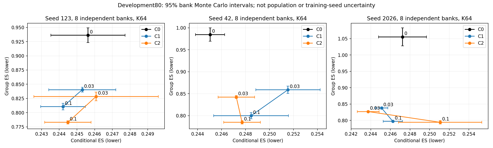
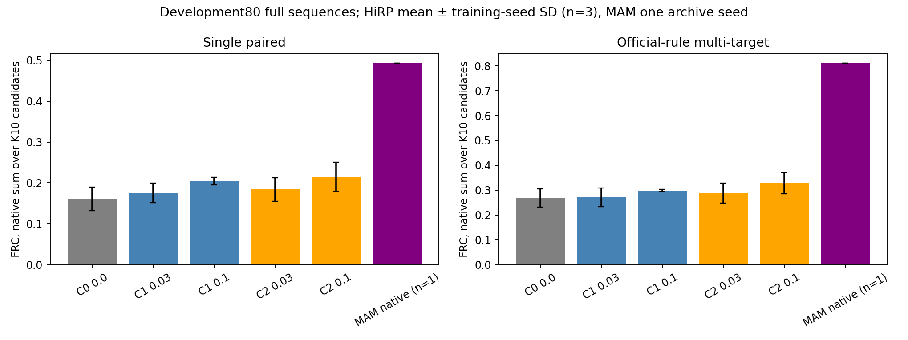

# HiRP Phase 2.4：评价精度与多目标任务对照

**任务证据：** 相同多目标开发清单下，C2在两个λ×三个训练seed的6/6组对比中FRC高于C1，6/6组高于C0。前者支持本轮监督粒度连接的任务价值，后者支持利用群体标签的价值。λ=.1的单配对FRC不具有同样的全seed一致方向。MAM归档模型的同清单FRC为0.810962，仍明显高于本轮HiRP候选；没有声称超越既有方法或得到独立确认。

**最有根据的优势：** 八个新独立K64 bank下，C2−C1群体ES的六个逐seed/λ对比中，6/6均值更低，5/6的bank Monte Carlo区间完全低于0。这是监督连接方式的开发分布证据，区间不包含人物抽样或训练seed不确定性。

**下一项决策：** 保留固定方法和C2(.03)/C2(.1)两种用途，不再为1%过线增加训练、bank或λ。将当前可支持主张限定为：在这组三seed从零HiRP对照中，C2相对C1的群体ES和多目标FRC方向一致改善；不包装成超越MAM。下一步先确定合法独立确认人口，MAM原生任务差距不能用descriptor ES替代。

## 冻结方法与人群

基准`8d7e788a88b494882bed1f5565807796da5fb071`，本地分支`agent/hirp-phase24-multitarget-evaluation`。开始时工作树干净，无更晚提交或AGENTS指令。所有模型、损失和历史评价函数未修改；本轮训练步数为0。十五个已有checkpoint按metadata核对arm、实际λ、seed、2000实际步、模型/尺度/prior配置。[候选清单](candidate_manifest.json)保留C0、C1/C2的.03/.1×三seed；.3旧前沿完整保存在[历史表](analysis_v1/historical_frontier_all_lambdas.csv)，没有新增该端点评价搜索。

仍使用原Development-80、T128 source-centred crop、unit25维paired ES和train-only frozen75维描述符scaler。条件项pair_lengths、描述符source_lengths、float32距离和群体共享noise index排除规则均不变。8个新bank种子24001–24008，每bank K64，公开sampler/eval模式，每bank独立合法U-statistic后再平均；不flatten为伪iid总体。

当前方法解释限于同session、同权重、同固定欧氏空间的理想独立期望：E_x S(P_x,Q)=S(Pbar,Q)+¼E D_E(P_x,P_x′)。C1的群体项额外施加条件分布相似性压力；C2通过边际匹配保留条件差异的余地，同时继续接受同一paired ES约束。它不是说输入间越远越好，也不是所有set-set方法共有的惩罚。任务指标用于检验这种连接差异是否具有实际反应价值。

## 八bank精度与条件—群体对照

| 方法 | λ | conditional ES：三训练seed均值±SD | group ES：三训练seed均值±SD |
|---|---:|---:|---:|
| C0 | 0 | 0.245968 ± 0.001139 | 0.992026 ± 0.059875 |
| C1 | 0.03 | 0.247313 ± 0.003660 | 0.845753 ± 0.011470 |
| C1 | 0.1 | 0.246309 ± 0.002124 | 0.802547 ± 0.007092 |
| C2 | 0.03 | 0.245682 ± 0.001776 | 0.832612 ± 0.008524 |
| C2 | 0.1 | 0.247756 ± 0.003293 | 0.787331 ± 0.006034 |

图中区间只表示固定模型/开发集下的bank Monte Carlo误差；三seed SD单独描述训练重复，二者不能相加为人物独立确认。Student-t df7区间基于八个独立bank差值的小样本近似。

| seed | λ | 对照 | conditional 差值 [95% MC CI] | group 差值 [95% MC CI] |
|---:|---:|---|---:|---:|
| 123 | 0.03 | C2-C0 | +0.000456 [-0.004098, +0.005010] | -0.107770 [-0.122225, -0.093315] |
| 123 | 0.03 | C2-C1 | +0.000780 [-0.003458, +0.005019] | -0.011946 [-0.021035, -0.002857] |
| 123 | 0.1 | C2-C0 | -0.001138 [-0.004004, +0.001728] | -0.153341 [-0.166243, -0.140438] |
| 123 | 0.1 | C2-C1 | +0.000273 [-0.001326, +0.001872] | -0.027702 [-0.033175, -0.022228] |
| 42 | 0.03 | C2-C0 | +0.002186 [+0.000311, +0.004060] | -0.142165 [-0.159075, -0.125256] |
| 42 | 0.03 | C2-C1 | -0.004313 [-0.006247, -0.002378] | -0.016504 [-0.024223, -0.008785] |
| 42 | 0.1 | C2-C0 | +0.002667 [+0.000638, +0.004696] | -0.199668 [-0.215554, -0.183781] |
| 42 | 0.1 | C2-C1 | -0.000756 [-0.003307, +0.001796] | -0.014988 [-0.022205, -0.007771] |
| 2026 | 0.03 | C2-C0 | -0.003498 [-0.005447, -0.001548] | -0.228307 [-0.255144, -0.201469] |
| 2026 | 0.03 | C2-C1 | -0.001361 [-0.002562, -0.000159] | -0.010974 [-0.014511, -0.007436] |
| 2026 | 0.1 | C2-C0 | +0.003834 [+0.001095, +0.006573] | -0.261076 [-0.292386, -0.229766] |
| 2026 | 0.1 | C2-C1 | +0.004824 [+0.000919, +0.008729] | -0.002957 [-0.006665, +0.000751] |

每bank原始差值与SE见[paired MC表](analysis_v1/paired_MC_intervals.csv)、[逐bank差值](analysis_v1/paired_per_bank.csv)。预定前四/后四bank均完整展示于[分半诊断](analysis_v1/paired_half_diagnostics.csv)，没有择优选半组或追加采样。

| seed | 方法 | λ | 1%工作容差状态（相对同seed C0） |
|---:|---|---:|---|
| 42 | C0 | 0 | 满足（MC区间整体在阈值内） |
| 42 | C1 | 0.03 | 不满足（MC区间整体超阈值） |
| 42 | C1 | 0.1 | 估计区间跨越阈值 |
| 42 | C2 | 0.03 | 估计区间跨越阈值 |
| 42 | C2 | 0.1 | 估计区间跨越阈值 |
| 123 | C0 | 0 | 满足（MC区间整体在阈值内） |
| 123 | C1 | 0.03 | 满足（MC区间整体在阈值内） |
| 123 | C1 | 0.1 | 满足（MC区间整体在阈值内） |
| 123 | C2 | 0.03 | 估计区间跨越阈值 |
| 123 | C2 | 0.1 | 满足（MC区间整体在阈值内） |
| 2026 | C0 | 0 | 满足（MC区间整体在阈值内） |
| 2026 | C1 | 0.03 | 满足（MC区间整体在阈值内） |
| 2026 | C1 | 0.1 | 满足（MC区间整体在阈值内） |
| 2026 | C2 | 0.03 | 满足（MC区间整体在阈值内） |
| 2026 | C2 | 0.1 | 估计区间跨越阈值 |

容差判定使用每bank的 L_model−1.01 L_C0 差值及其MC区间，仅是工程筛选，不是统计等效。跨阈值不等于方法无效。[逐seed全量表](analysis_v1/per_seed_8bank.csv)同时保留ES cross/self、spread、SE和区间；历史K32/K64点未改写。

## 多目标开发任务：与单配对分表

本地冻结ReactionDataset的test规则为paired置首，再取同session九条alternative；排除paired后池≥9用random.sample，否则random.choices，单条池允许重复paired，不额外去重。实际采用原constructor的视频池及其顺序，仅把该规则用于已用过的VAL Development-80，未使用confirmation source。真实池大小13/14/111/112/113；每输入10个目标，当前清单无不足池情况，短池规则另有临时单元测试及官方AST逐项等价检验。所有目标路径、hash、role/session/length、选择seed、顺序及权重记录在[多目标清单](multitarget_development_manifest.json)。

C0的历史通用checkpoint配置仍存储lambda_group=.1，但C0分支不读取群体项，有效λ=0；候选清单同时记录并校验这两个字段，没有改写checkpoint。

同一source全长271–6781帧、总169794帧，K10、同一旧bank0前十ε、固定750块；每sample index跨时间块共用ε。全部导出检查长度、有限值、合法域和候选分块一致性；[块边界诊断](analysis_v1/boundary_diagnostics.csv)比较750块边界与普通相邻帧变化，没有新增平滑。MAM保持原生固定集合，没有伪装成随机样本。

719个目标非等长。真实短目标958→1926、长目标1926→1167、跨三段2253→1053均通过原Processor；相同RNG下改变预测值而保持shape的最大误差0。原随机重参数化不修改，处理一次后共享同一缓存。目标处理RNG是固定协议条件，未作为另一层随机性重复。[非等长集成记录](unequal_processor_tests.json)。

### 多目标表

| seed | 方法 | λ | FRC ↑ | FRVar | S-MSE | temporal S-MSE | TLCC（原版） |
|---:|---|---:|---:|---:|---:|---:|---:|
| 42 | C0 | 0 | 0.254210 | 0.006084 | 0.127265 | 0.008207 | 44.050 |
| 42 | C1 | 0.03 | 0.248042 | 0.004264 | 0.111273 | 0.004799 | 43.688 |
| 42 | C1 | 0.1 | 0.294351 | 0.006619 | 0.110036 | 0.007218 | 43.650 |
| 42 | C2 | 0.03 | 0.269588 | 0.004944 | 0.112890 | 0.005332 | 44.263 |
| 42 | C2 | 0.1 | 0.302705 | 0.008884 | 0.116700 | 0.009196 | 45.388 |
| 123 | C0 | 0 | 0.240179 | 0.007451 | 0.108648 | 0.012618 | 48.162 |
| 123 | C1 | 0.03 | 0.251296 | 0.003856 | 0.094337 | 0.004112 | 43.912 |
| 123 | C1 | 0.1 | 0.298005 | 0.004499 | 0.084269 | 0.003779 | 43.188 |
| 123 | C2 | 0.03 | 0.261027 | 0.006095 | 0.115444 | 0.008870 | 45.438 |
| 123 | C2 | 0.1 | 0.303531 | 0.007516 | 0.091710 | 0.006857 | 43.225 |
| 2026 | C0 | 0 | 0.310684 | 0.013964 | 0.077393 | 0.017000 | 43.925 |
| 2026 | C1 | 0.03 | 0.314712 | 0.005252 | 0.104361 | 0.005338 | 43.700 |
| 2026 | C1 | 0.1 | 0.302861 | 0.007248 | 0.094540 | 0.008409 | 43.638 |
| 2026 | C2 | 0.03 | 0.334123 | 0.006788 | 0.102237 | 0.006864 | 43.750 |
| 2026 | C2 | 0.1 | 0.378116 | 0.009235 | 0.116012 | 0.006687 | 43.725 |
| 1 | MAM | native | 0.810962 | 0.058912 | 0.157204 | 0.066217 | 49.000 |

### 单配对表（独立诊断口径）

| seed | 方法 | λ | FRC ↑ | FRVar | S-MSE | temporal S-MSE | TLCC（原版） |
|---:|---|---:|---:|---:|---:|---:|---:|
| 42 | C0 | 0 | 0.161504 | 0.006084 | 0.127265 | 0.008207 | 44.050 |
| 42 | C1 | 0.03 | 0.159482 | 0.004264 | 0.111273 | 0.004799 | 43.688 |
| 42 | C1 | 0.1 | 0.195136 | 0.006619 | 0.110036 | 0.007218 | 43.650 |
| 42 | C2 | 0.03 | 0.169462 | 0.004944 | 0.112890 | 0.005332 | 44.263 |
| 42 | C2 | 0.1 | 0.182736 | 0.008884 | 0.116700 | 0.009196 | 45.388 |
| 123 | C0 | 0 | 0.132459 | 0.007451 | 0.108648 | 0.012618 | 48.162 |
| 123 | C1 | 0.03 | 0.164300 | 0.003856 | 0.094337 | 0.004112 | 43.912 |
| 123 | C1 | 0.1 | 0.212745 | 0.004499 | 0.084269 | 0.003779 | 43.188 |
| 123 | C2 | 0.03 | 0.165522 | 0.006095 | 0.115444 | 0.008870 | 45.438 |
| 123 | C2 | 0.1 | 0.207928 | 0.007516 | 0.091710 | 0.006857 | 43.225 |
| 2026 | C0 | 0 | 0.190111 | 0.013964 | 0.077393 | 0.017000 | 43.925 |
| 2026 | C1 | 0.03 | 0.203235 | 0.005252 | 0.104361 | 0.005338 | 43.700 |
| 2026 | C1 | 0.1 | 0.205102 | 0.007248 | 0.094540 | 0.008409 | 43.638 |
| 2026 | C2 | 0.03 | 0.216984 | 0.006788 | 0.102237 | 0.006864 | 43.750 |
| 2026 | C2 | 0.1 | 0.253183 | 0.009235 | 0.116012 | 0.006687 | 43.725 |
| 1 | MAM | native | 0.492871 | 0.058912 | 0.157204 | 0.066217 | 49.000 |

### 三类证据分别解释

- C2(0.03)−C1多目标FRC：seed123/42/2026分别为 +0.009730, +0.021546, +0.019411；这是连接粒度对照。
- C2(0.03)−C0多目标FRC：seed123/42/2026分别为 +0.020848, +0.015378, +0.023439；这是群体标签利用价值对照。
- C2(0.1)−C1多目标FRC：seed123/42/2026分别为 +0.005525, +0.008354, +0.075255；这是连接粒度对照。
- C2(0.1)−C0多目标FRC：seed123/42/2026分别为 +0.063352, +0.048495, +0.067432；这是群体标签利用价值对照。

多目标与单配对的对照提示：λ=.1的收益更稳定地体现在群体目标匹配，而不是每seed都提升单个配对轨迹对应关系。这与监督粒度主线一致，但FRC的目标最大匹配不等于完整条件分布恢复；当前人口仍是开发集。

FRC遵守逐候选在十目标中取最大CCC、再对十候选求和的原实现；没有把候选求和改平均，也没有据GT选择/排序输出。每输入保存10×10候选—目标CCC、候选对距离、通道时间方差和首候选TLCC，足以复核原聚合。TLCC保持原首候选实现（并可在极端lag饱和）；temporal S-MSE明确为仓库既有扩展，不新增指标定义。FRVar/S-MSE不是越大越好的质量结论。

MAM使用归档明确标注的offline evidence代表性checkpoint，经原MANIFEST核验；不是从EQR名字推断。原档说明的/tmp源码目录已不存在，不能恢复精确原git commit；采用完整归档源码/权重hash锁定版本。该模型有预训练anchor50epoch、EQR warmstart、B_fit三epoch，原生AU rounding、residual=.95、style=.95及1.8/.4/1.6通道系数保持不变。本轮公共FP32/TF32关闭（归档CLI默认TF32开启）已记录，不能称原CLI逐bit复现。目标manifest/Processor/长度/K/指标对齐，但训练预算、原生输出后处理和候选语义不同，仅一个MAM seed。因此该行是任务参考，不证明架构或监督粒度的因果优势。[MAM来源](mam_provenance.json)、[实际接入](mam_integration.json)。

## 实现与验证附件

新namespace完整依赖快照覆盖HiRP实际model/data/descriptor/scorer Python和legacy evaluator源文件、Processor权重/config；离线报告/setup/test工具不参与推理依赖。先验签实际mean/std再生成或读取任何导出/结果缓存。旧cache没有补标签或覆盖。临时decoder/session模块及归一化内容变更均拒绝复用；原输入/噪声聚合数值误差0。[缓存回归](cache_dependency_regression.json)、[执行命令](EXECUTED_COMMANDS.md)、[数据与人口未决项](population_pending.json)。

源码回归124 passed/3 skipped/1 xfailed，另新增官方AST选择规则的5项focused测试通过。跳过项为既有CUDA环境检查，预期失败为既有CPU autocast限制；真实GPU非等长与模型导出另外执行。没有运行任何新训练、λ=.3扩展或新增noise bank。

## 明确未执行与边界

- 独立confirmation：未执行；缺权威recording/interaction与人物跨session/split映射、Camera↔CSV crosswalk及完整特征provenance。没有用面孔推断身份。历史full-VAL listener pool已参与开发，不能称候选标签未接触。
- exact FRD：已有实现，但本轮未分配16模型×80全长输入×100候选目标对的二次DTW预算；未用descriptor ES或0替代。距离型FRD也不是视频真实感。
- 渲染/视频真实感、隐藏测试或榜单：未运行。本轮只叫“Development-80、官方多目标规则/指标实现对齐的开发评价”。
- 更多训练seed、λ、bank和模型重构：未执行。普通条件随机生成、FiLM、ES、代数分解不作为首次发明；相似性压力解释只适用于当前独立期望/同一固定空间目标，不能泛化到所有set-set方法。
- Git push：未执行；提交只包含代码、协议/指纹、指标和报告，不含数据数组、checkpoint、凭据或运行环境。
