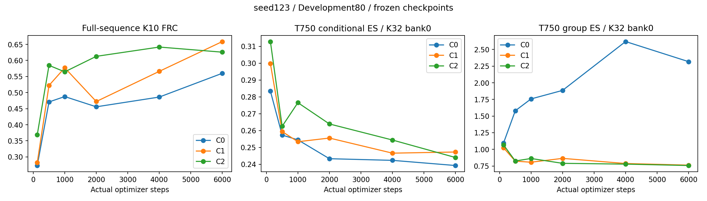
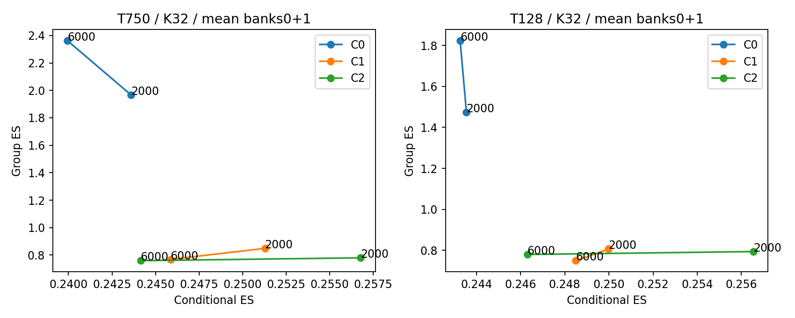

# HiRP T750：seed123 最终评价与任务取舍

本轮最明确的结果是：在与训练时间尺度对齐的 T750 评价中，C2 比 C1 的群体 descriptor ES 更低，同时条件 ES 点估计略低；但 6000 步的官方多目标 FRC 是 C1 更高。群体边际监督有分布拟合价值，尚不能概括为所有任务指标更优。下一项决策应是明确以任务 FRC 还是条件—群体分布取舍为主判据；现有预算已完成，本报告不追加训练、lambda 或 noise bank。

用户已要求暂停多 seed；以下正式结论仅来自 seed123。seed42 的部分训练记录保留但不参与任何均值、区间或方法选择。Development-80 为反复使用的开发集，不是独立确认或官方榜单。

## 方法与实际执行范围

网络仍为原 HiRP22、standard_normal、pre-norm/default projections、连续全局 epsilon。C0=paired trajectory ES；C1/C2 再加0.1倍原逐输入/跨输入群体估计器。无新网络模块或训练损失。三组从同一seed随机初始化，source/crop/reference/noise流hash一致，均实际执行6000步，训练行数6000，A0 prior未变化。

T750、B4 independent source occurrences、K_train4、FP32、AdamW lr1e-4/weight_decay.01。source crop为按seed/occurrence/source ID决定的source-only均匀起点，paired target使用同一起点；reference独立裁剪。只缓存原数组；全计划无零有效pair。训练集新scaler使用每unique reference四个固定均匀crop，按source总体对应的session权重拟合，三个arm共用。source-paired有限总体与全reference有限总体仍不同。

实际 TemporalBlock/完整HiRP回归显示：T128 d128左右核数据梯度为0，T750为非零；T750但仅128有效帧时仍为0。测量在optimizer前，与weight decay无关。它证明连接获得有效数据支持，不证明整个任务改善完全由这层引起。

## 固定端点：不同评价口径并列

ES为T750新crop/scaler协议、K32、既有bank0+bank1分别评分后平均。任务为完整Development80、K10、既有1+9目标槽位、同一Processor cache、750-frame blocks和全局noise。跨时间块不重采epsilon；候选与参考未重排。

| step | arm | conditional ES ↓ | group descriptor ES ↓ | 多目标FRC ↑ | 单配对FRC ↑ |
|---:|---|---:|---:|---:|---:|
| 2000 | C0 | 0.243589 | 1.967402 | 0.455798 | 0.330228 |
| 2000 | C1 | 0.251282 | 0.848730 | 0.472200 | 0.347461 |
| 2000 | C2 | 0.256773 | 0.779748 | 0.612683 | 0.433621 |
| 6000 | C0 | 0.239940 | 2.362463 | 0.560068 | 0.387232 |
| 6000 | C1 | 0.245863 | 0.768347 | 0.658696 | 0.445386 |
| 6000 | C2 | 0.244142 | 0.758911 | 0.625661 | 0.415518 |

6000步C2−C1：group ES −0.009436（−1.23%），conditional ES −0.001721（−0.70%），多目标FRC −0.033035。C2−C0：conditional ES +0.004202（约+1.75%），但group ES显著更低，FRC +0.065593。不能称C2相对C0“同等条件质量”，也不能把普通工作容差当统计等效。

完整128/500/1000/2000/4000/6000步结果保存在 [task_curve.csv](analysis/task_curve.csv) 和 [ES_all_banks.csv](analysis/ES_all_banks.csv)。学习曲线只用bank0，端点双bank均值另表，未混作同一序列。

### 成对session区间

下表是6000步C2−C1的成对20-session bootstrap描述性95%区间（固定模型、评估清单和bank）。不覆盖训练seed不确定性；已有两bank/三个置换不是额外训练seed。权威participant/interaction映射尚缺，跨session人物依赖未排除，因此不能视为严格人物独立推断；这些多项探索性区间未作多重比较校正。

| 口径 | 差值 | 区间 |
|---|---:|---|
| T750 conditional ES | −0.001721 | [−0.003701, +0.000101] |
| T750 group ES | −0.009436 | [−0.015223, −0.003323] |
| 完整多目标FRC | −0.033035 | [−0.065751, −0.003405] |
| 完整单配对FRC | −0.029867 | [−0.054890, −0.005708] |
| target-side matching mean | +0.000771 | [−0.000978, +0.002650] |
| T750 shuffle-gap（两bank、三既有置换平均） | −0.000720 | [−0.002251, +0.000904] |

所有逐例配对值与其他对照区间见 [paired_session_intervals.csv](analysis/paired_session_intervals.csv)、[task_per_input.csv](analysis/task_per_input.csv)。ES原始文件保存每个输入、每个session、cross/self项、共同mask下正确/置换评分与各置换结果。

## 时间尺度敏感性与旧实验对照

同一批新模型回到历史T128中心crop/旧scaler，6000步双bank K32 group ES为C0 1.823072、C1 0.749730、C2 0.779950。C2−C1为 **+0.030220**，session区间[+0.015902,+0.047981]；群体排序与T750相反。这里同时改变了评价长度、crop法则与scaler，不能把翻转单独归因于任何一项，更不能跨尺度计算改善百分比。

在相同完整多目标任务协议、相同2000优化步下，旧T128→新T750的FRC：C0 0.240179→0.455798；C1 0.298005→0.472200；C2 0.303531→0.612683。相同source/reference ID调度已核对，但每arm有效训练帧从1,023,580增至5,720,135（约5.59倍），同时crop/scaler改变，不能将差异全称为dilation收益。成本明细见 [T128_T750_training_cost_bridge.csv](analysis/T128_T750_training_cost_bridge.csv)。

## 任务覆盖与独立形态诊断

官方FRC保持sum_k max_j CCC，非百分比，不是覆盖所有目标的保证。6000步target-side mean为C0 0.027521、C1 0.033382、C2 0.034153；一对一mean为0.024991、0.030498、0.031412。C2这两个点估计略高于C1，但成对区间跨0。重复target槽位和既定权重未删除；这些值不是语义模式数或条件概率恢复。

用已有完整K10预测与同一已处理10目标槽位，新增不参与训练的covariance/固定lag诊断（原始单位、常量无定义通道显式排除）：

| arm | channel covariance RMSE ↓ | lag1 autocorr MAE ↓ | lag10 MAE ↓ | lag30 MAE ↓ |
|---|---:|---:|---:|---:|
| C0 | 0.027881 | 0.154124 | 0.203028 | 0.196187 |
| C1 | 0.021710 | 0.230036 | 0.169699 | 0.199811 |
| C2 | 0.021328 | 0.307481 | 0.161673 | 0.194560 |

C2的covariance误差稍低，但短lag1误差更高，不支持全面更好的时间形态。目标统计继承原Processor行为，不是真实未处理全长反应的直接替代。定义和逐例值见 [auxiliary/protocol.json](auxiliary/protocol.json)、[auxiliary/per_input.csv](auxiliary/per_input.csv)。

固定case0/20/40/60的完整轨迹已保存：展示全部10候选、固定sample0和paired target，灰线标750块边界，未选最好候选。例：[case0](auxiliary/full_trajectory_case0.png)、[case20](auxiliary/full_trajectory_case20.png)、[case40](auxiliary/full_trajectory_case40.png)、[case60](auxiliary/full_trajectory_case60.png)。

6000步块边界/普通内部帧的平均绝对变化：C0 0.14029/0.04193，C1 0.15809/0.03588，C2 0.19035/0.04153。C2边界变化较大，说明训练块长度对齐不等于完整全局上下文或跨块连续性已解决。本轮不悄悄加入blend/平滑。

## 有界 exact FRD 与 MAM

固定每session一条、共20条Development source，全有效长度、同10候选/10目标、原三组unrestricted DTW加权及候选取min后求和。下表仅为 **2000步模型子集诊断**，不是6000步结果。

| 模型 | exact FRD ↓ | 完成候选—目标配对 |
|---|---:|---:|
| C0 seed123 step2000 | 371.390122 | 2000/2000 |
| C1 seed123 step2000 | 365.774668 | 2000/2000 |
| C2 seed123 step2000 | 329.507982 | 2000/2000 |
| MAM归档原生参考 | 172.576423 | 2000/2000 |

共8000配对/24000次DTW完整落盘。C2较C1距离降低约9.92%，但MAM仍明显更低；MAM完整多目标FRC为0.810962，也高于本轮三个HiRP最终点。MAM只有一个原生配置，预训练/预算/rounding与缩放不同，不是架构等预算因果对照。FRD是距离型属性指标，不是视频真实感；未用代理或0替代。

## 输出路径、数值检查与运行完整性

6000步训练诊断的随机残差tanh饱和占比C0/C1/C2约52.40%/69.35%/56.12%，但AU/VA/expression噪声VJP均有限非零，不能由饱和比例单独判定整条路径失效。全部分项梯度、cosine与ratio轨迹保留；例如C2末步weighted-group/conditional梯度比0.1693，cosine0.1393。A0 prior梯度0是设计要求。见 [gradient_curve.csv](analysis/gradient_curve.csv)、[saturation_curve.csv](analysis/saturation_curve.csv)。

C0旧评价因chunk10/3的最大绝对差1.034e-5超过1e-5停止。24个固定案例诊断：FP32分块最大差1.556e-5，FP64最大差2.071e-14。新版本没有更换生产FP32/K10输出，而是对每个旧检查未通过案例执行FP64分块验证、FP32到高精度参照误差界与实际FRC差异检查。44个案例走此路径，最大FP64分块误差4.322e-14，最大多目标FRC分块差1.180e-8；原始失败记录保留。数值协议事先写入 [numerical_protocol.json](numerical_protocol.json)，不是静默抬高旧阈值。新结果使用独立namespace，旧identity不回填。

CPU全仓测试137 passed、3 skipped、1 xfailed；真实T750模型连续2步/1+1恢复的参数、optimizer和训练行误差0。GPU三arm各3步smoke通过，随后真实6000步训练/18点任务评价/48项ES评价完成。137测试不等于137项研究进展；真正新增证据是上述固定对照。

## 成本、版本与停止项

每arm实际6000步、24000 source occurrences、17,135,366有效source/pair帧、18,000,000 tensor帧；唯一source覆盖1660，C1/C2 reference exposure各48000，C0为0。occurrence曝光不是无放回epoch。参数量均8,729,496。

C0/C1/C2累计训练墙钟约1813/2186/2107秒，峰值约2.34/2.38/2.38GiB。并行/共享GPU负载不同，这些墙钟数不能直接作为算法效率排名。明细和checkpoint内容指纹见 [training_accounting.csv](analysis/training_accounting.csv)、[checkpoint_fingerprints.json](analysis/checkpoint_fingerprints.json)。

基线/current HEAD仍为`7e6adf562d628aff78a9e22d74a111def7fa3353`，工作分支`agent/hirp-phase25-timescale-alignment`。新代码/报告尚未提交；未push。源码快照、patch与实际命令记录随本目录交付。

用户要求暂停多seed后，seed42 C0/C1日志停在5090/1052步，已验证持久checkpoint为5000/1000；不计入结果。seed42 C2与seed2026未训练。没有继续训练或自动恢复这些任务。

未执行：独立confirmation（权威人物/互动映射未获证据）；完整80-source FRD及6000步FRD（超出原20-source/2000步有界计划）；视频真实感（未运行渲染）；额外lambda/先验/网络搜索（本轮禁止）。这些不以其他指标冒充。

## 本轮支持的主张与下一项决策

1. C1/C2相对C0的任务FRC和群体ES改善，支持利用群体标签的开发价值；C0的条件ES更好，显示条件-only端点仍必要。
2. C2相对C1在T750下有更低群体ES和略低条件ES点估计，但FRC更低、T128群体排序反转、短lag1误差更高。当前支持“特定时间尺度下的条件—群体拟合取舍”，不支持普遍层级优势。
3. 原生MAM参考仍领先现有HiRP的若干任务指标；不同预算不能用于纯架构归因，也不能忽略这个任务差距。

建议保留完整C0/C1/C2结果并结束本轮训练。若当前交付首要目标是官方多目标FRC，应如实以C1的6000步点为本轮较高值；若论文主问题是群体边际拟合，C2的T750证据可保留，但必须同时给出FRC与时间尺度边界。此次不再自动添加实验。
